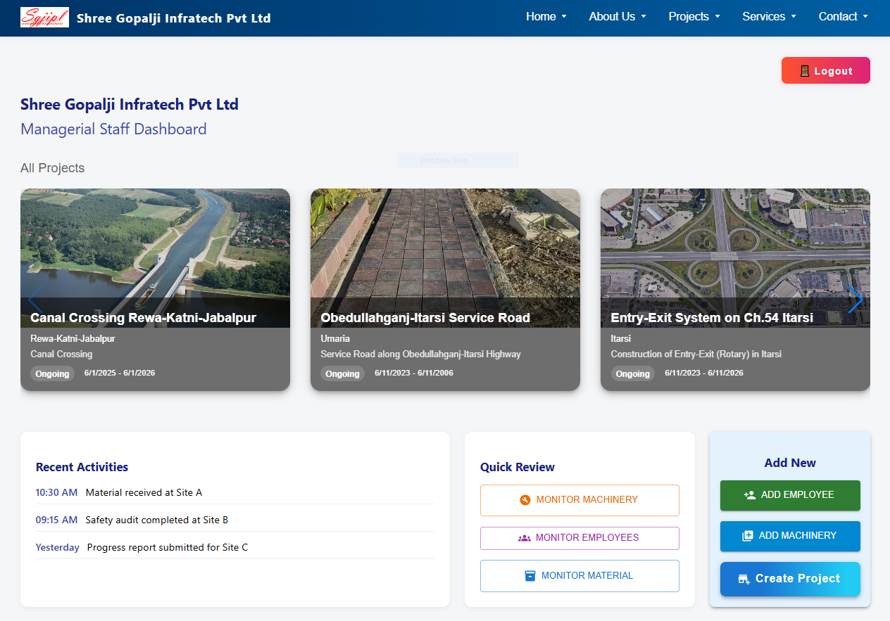
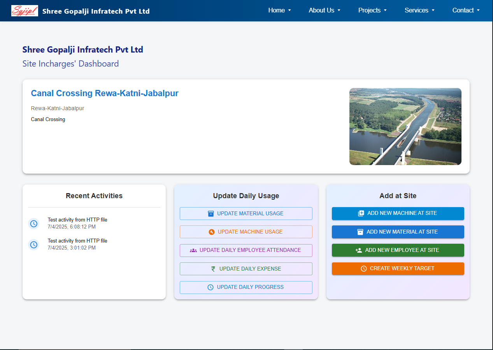

# Documentation Of Work

**Date:** 28-06-2025  
**Author:** Ayush Sharma  
**Project:** Shree-Gopal-ji — Centralized System + Website 

---

## Successfully Integrated API Endpoints

### 🔐 Authentication
- `POST /api/auth/register` – Sign up a new user  
- `POST /api/auth/login` – Login a user  
- `POST /api/auth/logout` – Logout user  
- `GET /api/auth/profile` – Get user details  

### 📁 Project Management
- `POST /api/project/` – Create a new project  
- `GET /api/project` – Get all projects' details
- `GET /api/project/:id` – Get any project's details

### 🧱Material Management
- `POST /api/materials/dumped` - Add a new Material to Site
- `GET /api/materials/` - Get details of all dumped Material
- `POST /dumped/:id/usage` - Update Material Usage

### 🏗️ Machine Management
- `POST /api/machines/create` – Add a new machine  
- `POST /api/machines/assign` – Assign a machine to a project  
- `GET /api/machines` – Get all machine's details  
- `POST /api/machines/:<machineId>/usage` – Update any machine's usage  

### 👷 Employee Management
- `POST /api/users` – Add a new user  
- `GET /api/users` – Get all users' details  
- `POST /api/users/assign` – Assign a user to a site  
- `POST /api/users/attendance` – Take user attendance  
- `GET /api/users/attendance` – Get user attendance  

---

## 🚀 Future Scope
- Material delivery, usage, stock tracking & **automated order generation** when stock is empty (loop logic)  
- Weekly target & progress tracking / milestone setting  
- **Detection systems** for:
  - Payment fraud  
  - Fake machine usage  
  - False attendance  
- **Site-wise expense & ledger management** with cost/profit calculation  
- Deployment plans

---
